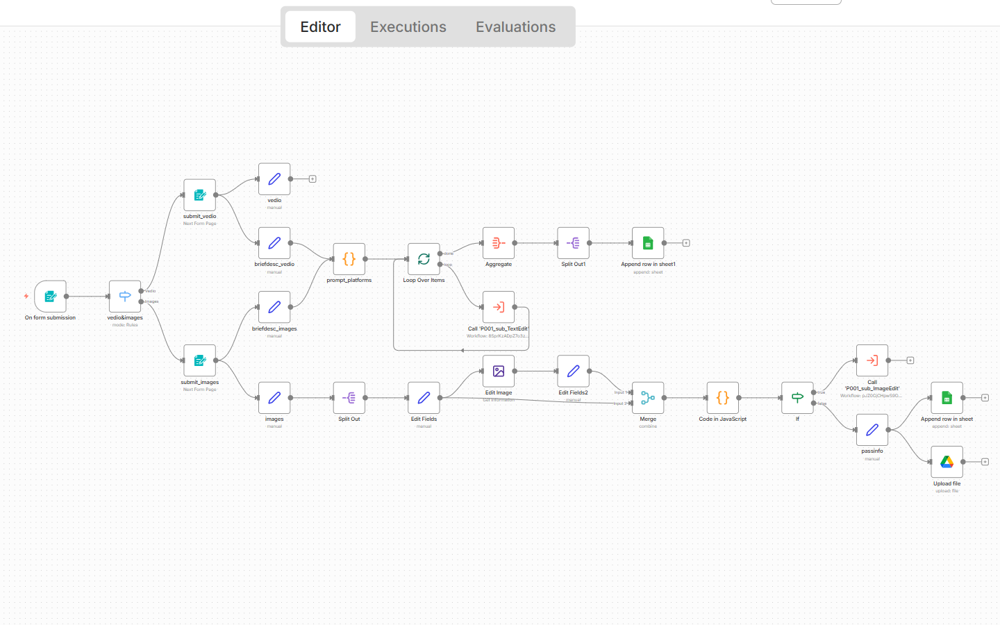
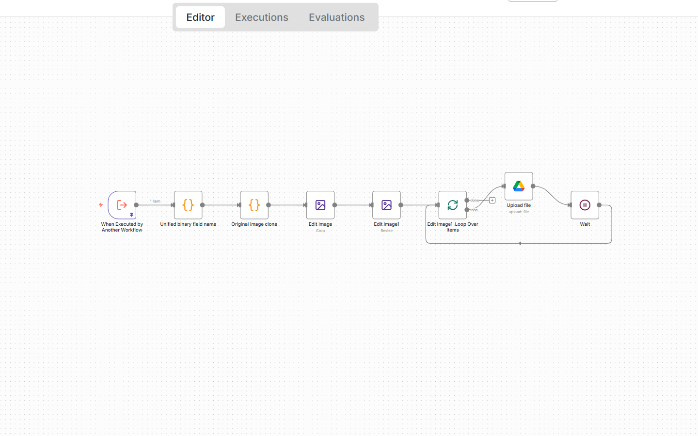
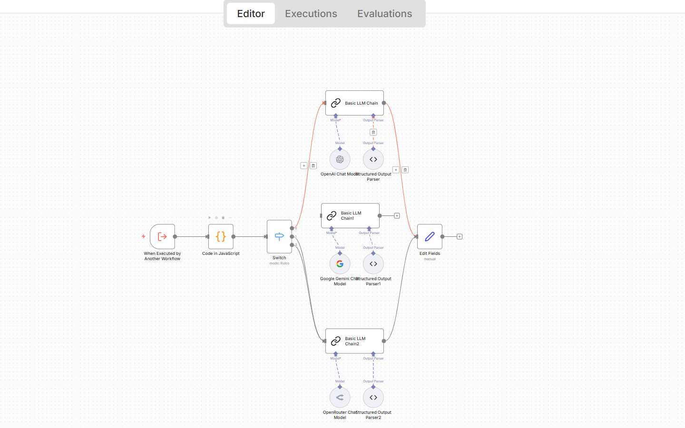

# Table of Contents
- [Purpose & Philosophy](#-purpose--philosophy)
- [Features](#-features)
  - [Main Image Quality Check](#-main-image-quality-check-qa-engine)
  - [Multi-Platform Image Adaptation](#-multi-platform-image-adaptation-preset-system)
  - [AI Copywriting Pipeline](#-ai-copywriting-pipeline-structured-output)
- [Workflow Architecture](#-workflow-architecture)
- [Screenshots](#-screenshots)
  - [Main Workflow](#main-workflow)
  - [ImageEdit Subworkflow](#imageedit-subworkflow)
  - [TextEdit Subworkflow](#textedit-subworkflow)
- [Repository Structure](#-repository-structure)
- [Requirements](#-requirements)
- [Installation & Usage](#-installation--usage)
- [Roadmap](#-roadmap)
- [License](#-license)
- [Contact](#-contact)

# auto-publishing-agent-n8n
A modular n8n-based Auto Publishing Agent for creators and teams. It includes image quality checking, multi-platform image adaptation, and AI-powered copywriting. Designed to standardize the publishing workflow so people can focus on differentiating their own products and services.

# Auto Publishing Agent (n8n Workflow)
### Standardize Promotion · Strengthen Product Differentiation

A modular, extensible **Auto Publishing Agent** built with n8n.  
This project automates the *mechanical and repetitive* parts of promotion — image preparation, platform adaptation, metadata generation, and AI copywriting — so creators, teams, and businesses can focus their energy where it truly matters:

## **Building differentiated products and delivering differentiated services.**

Promotion should not drain the energy needed for innovation.  
Automation should remove friction, not add complexity.

This repository contains a full end-to-end automation system:
- 1 Main Workflow  
- 2 Sub-workflows (ImageEdit + TextEdit)  

---

# 🌍 Purpose & Philosophy

In modern creation, true value comes from **unique products and meaningful services**, not from repeatedly learning how each platform prefers images, text, or formatting.

Most creators face the same bottlenecks:
- Different aspect ratios per platform  
- Repetitive cropping/resizing work  
- Inconsistent copywriting styles  
- Manual batch publishing  

None of these tasks contribute to differentiation.

### This project aims to shift the balance:
# 👉 **Standardize and automate promotion,  
so creators can focus on their differentiated value.**

---

# 🚀 Features

## ✔ Main Image Quality Check (QA Engine)

Evaluates uploaded images according to platform standards:
- Width/height/ratio detection  
- Portrait orientation check  
- 4:5 tolerance (±0.04)  
- Minimum short-edge constraint  
- Quality classification: `high / ok / low / none`  
- Human-readable `reasons[]`

**Workflow file:**  
[`P001_AutomaticallyPublishWorks.json`](P001_AutomaticallyPublishWorks.json)

---

## ✔ Multi-Platform Image Adaptation (Preset System)

Automatically generates platform-ready images.

Supported presets:
- Instagram: 1:1 / 4:5 / 9:16  
- Facebook: 1:1 / 4:5 / 9:16 / 16:9  
- X/Twitter: 1:1 / 16:9  

Features:
- Smart center cropping  
- Boundary handling  
- Resolution normalization  
- Structured file naming  
- Google Drive upload  

**Workflow file:**  
[`P001_sub_ImageEdit.json`](P001_sub_ImageEdit.json)

---

## ✔ AI Copywriting Pipeline (Structured Output)

Takes a raw prompt and produces structured promotional content:
- Platform  
- Title  
- Keywords  
- Polished content  

Supports:
- OpenAI  
- Gemini  
- OpenRouter  
- English + Chinese output pipelines  
- Round-robin model selection  
- Strict JSON schema validation  

**Workflow file:**  
[`P001_sub_TextEdit.json`](P001_sub_TextEdit.json)

---

# 🧠 Workflow Architecture

```
Main Workflow
│
├── Image Quality Check
├── Batch Routing
│
├── ImageEdit Subworkflow  → Multi-platform image generation
└── TextEdit Subworkflow   → AI copy creation
```

---

# 📸 Screenshots

### **Main Workflow**


---

### **ImageEdit Subworkflow**


---

### **TextEdit Subworkflow**


---

# 📦 Repository Structure

```
.
├── README.md
├── P001_AutomaticallyPublishWorks.json
├── P001_sub_ImageEdit.json
├── P001_sub_TextEdit.json
└── assets/
    ├── P001_AutomaticallyPublishWorks.png
    ├── sub_imageEdit.png
    └── sub_textEdit.png
```

---

# 🛠 Requirements

- n8n (self-hosted or cloud)
- Google Drive OAuth2  
- One or more LLM providers:
  - OpenAI  
  - Gemini  
  - OpenRouter  

---

# 📥 Installation & Usage

### 1. Import workflows
Upload all JSON workflow files into your n8n instance.

### 2. Configure credentials
- Google Drive  
- LLM provider(s)

### 3. Run the main workflow
Provide:
- Images  
- A text prompt  

### 4. Outputs
- Image quality classification  
- Multi-platform image variants  
- AI-generated structured promotional copy  

Extend with auto-posting, scheduling, analytics, more presets, or agentic behaviors.

---

# 🔭 Roadmap

- Automatic posting to Instagram / Facebook / X  
- Scheduling & batching  
- TikTok / LinkedIn / YouTube / Pinterest presets  
- Multi-language content generation  
- Performance analytics feedback loop  
- Full Agent Mode (choosing formats, optimizing outputs)

---

# 📜 License
MIT License — free for commercial and personal use.

---

# 📩 Contact

For collaboration or questions:

- **LinkedIn:** https://linkedin.com/in/yourprofile  
- **Email:** yourname.projects@gmail.com  

Feel free to open an Issue or Discussion in this repository.


